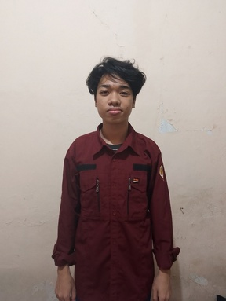

# PROJECT UAS PENGOLAHAN CITRA 2024

## Table of Content
- [PROJECT UAS PENGOLAHAN CITRA 2024](#project-uas-pengolahan-citra-2024)
  - [Table of Content](#table-of-content)
  - [Introduction](#introduction)
  - [Feature](#feature)
  - [Requirements](#requirements)
  - [Installation](#installation)
  - [Gambar yang digunakan](#gambar-yang-digunakan)
  - [Detail Gambar](#detail-gambar)
  - [Source Code](#source-code)
    - [Deteksi Tepi Pola Objek](#deteksi-tepi-pola-objek)
      - [Hasil deteksi tepi](#hasil-deteksi-tepi)
    - [Deteksi Tepi Pola Objek dan Contours Detection](#deteksi-tepi-pola-objek-dan-contours-detection)
      - [Hasil Deteksi Tepi Pola Objek dan Contours Detection](#hasil-deteksi-tepi-pola-objek-dan-contours-detection)
  - [Terima Kasih](#terima-kasih)

## Introduction

Deteksi tepi adalah teknik yang digunakan dalam pengolahan citra dan visi komputer untuk mengidentifikasi batasan-batasan objek dalam sebuah gambar. Tugas ini bertujuan untuk menerapkan algoritma deteksi tepi pada gambar pola objek, khususnya foto diri, dengan beberapa ketentuan khusus.

## Feature

- **Original Image Display**: Menampilkan gambar asli yang diambil sesuai ketentuan khusus (foto diri dari jarak minimal 2 meter).
- **Canny Edge Detection**: Menerapkan algoritma Canny Edge Detection untuk mendeteksi tepi-tepi pada gambar.
- **Contours Detection**: Menerapkan deteksi kontur untuk mengenali dan menampilkan kontur-kontur objek dalam gambar.
- **Combined Display**: Menampilkan gambar hasil deteksi tepi dan kontur secara bersamaan untuk analisis yang lebih komprehensif.

_Dengan fitur-fitur ini, pengguna dapat:_

1. Melihat gambar asli yang digunakan sebagai input.
2. Melihat hasil deteksi tepi menggunakan algoritma Canny.
3. Melihat hasil deteksi kontur untuk mengidentifikasi batasan-batasan objek dalam gambar.
4. Memahami bagaimana pengolahan citra dapat digunakan untuk analisis visual yang lebih mendalam.

## Requirements

Untuk menjalankan kode deteksi tepi pola objek ini, memerlukan beberapa perangkat lunak dan pustaka yang harus diinstal sebelumnya:

- Python 3.x: Bahasa pemrograman yang digunakan untuk menulis kode ini. Pastikan kamu sudah menginstal Python versi terbaru.
- OpenCV: Pustaka untuk pengolahan citra dan visi komputer.
- Matplotlib: Pustaka untuk visualisasi data, digunakan untuk menampilkan gambar.

## Installation

Untuk menjalankan kode deteksi tepi, Kita perlu menginstal pustaka Python berikut ini. Kita dapat menggunakan pip, penginstal paket Python, untuk menginstalnya. Jalankan perintah berikut di Jupyter Notebook:

```Python
!pip install opencv-python matplotlib
```

## Gambar yang digunakan



## Detail Gambar


## Source Code
### Deteksi Tepi Pola Objek

1. Import Library: Pada kode ini, kita mengimpor dua library utama yang digunakan untuk pemrosesan gambar dan visualisasi, yaitu cv2 (OpenCV) dan matplotlib.pyplot (Matplotlib).
```Python
# Import pustaka yang diperlukan
import cv2
import matplotlib.pyplot as plt
``` 

2. Load the Image: Kode ini memuat gambar dari file yang ditentukan oleh image_path menggunakan fungsi cv2.imread(). Karena OpenCV membaca gambar dalam format BGR (Blue, Green, Red), sedangkan Matplotlib mengharapkan format RGB, kita perlu mengonversi gambar tersebut ke format RGB menggunakan cv2.cvtColor()
```Python
# Membaca gambar
image = cv2.imread('foto_diri.jpg')
``` 

3. Convert Image to RGB: gambar akan diubah ke warna asli
```Python
# Konversi gambar ke rgb untuk asli
asli = cv2.cvtColor(image, cv2.COLOR_BGR2RGB)
``` 

4. Convert Image to Grayscale: Gambar yang sudah dimuat dan dikonversi ke RGB kemudian diubah menjadi citra grayscale menggunakan cv2.cvtColor() dengan parameter 
```Python
# Konversi gambar ke skala abu-abu
gray = cv2.cvtColor(image, cv2.COLOR_BGR2GRAY)
``` 

5. Edge Detection using Canny: Deteksi tepi dilakukan pada citra grayscale menggunakan metode Canny dari OpenCV. Fungsi cv2.Canny() mengambil dua parameter threshold yang menentukan batas bawah dan atas untuk deteksi tepi.
```Python
# Melakukan Canny Edge Detection
edges = cv2.Canny(gray, 50, 150)
``` 

6. Display Original and Edge Detected Image: Kode ini menggunakan Matplotlib untuk menampilkan dua subplot: gambar asli (subplot kiri) dan hasil deteksi tepi (subplot kanan). Fungsi plt.subplot() digunakan untuk menentukan posisi subplot, plt.imshow() untuk menampilkan gambar, plt.title() untuk menambahkan judul, dan plt.axis('off') untuk menyembunyikan sumbu.
```python
# Menampilkan gambar asli, gambar skala abu-abu, dan hasil Canny Edge Detection
plt.figure(figsize=(12, 6))
plt.subplot(121), plt.imshow(asli)
plt.title('Original Image'), plt.axis('off')
plt.subplot(122), plt.imshow(edges, cmap='gray')
plt.title('Canny Edge Detection'), plt.axis('off')
plt.show()
```
- plt.figure(figsize=(12, 6)): Membuat figure dengan ukuran 12x6 inci.
- plt.subplot(121), plt.imshow(image): Menampilkan gambar asli di subplot pertama (121).
- plt.title('Original Image'), plt.axis('off'): Menambahkan judul "Original Image" dan menyembunyikan sumbu pada subplot ini.
- nplt.subplot(122), plt.imshow(edges, cmap='gray'): Menampilkan hasil deteksi tepi (gambar grayscale) di subplot kedua (122).
- plt.title('Canny Edge Detection'), plt.axis('off'): Menambahkan judul "Canny Edge Detection" dan menyembunyikan sumbu pada subplot ini. 


#### Hasil deteksi tepi


### Deteksi Tepi Pola Objek dan Contours Detection
```python
# Import pustaka yang diperlukan
import cv2
import matplotlib.pyplot as plt

# Membaca gambar
image = cv2.imread('foto_diri.jpg')

# Konversi gambar ke rgb untuk asli
asli = cv2.cvtColor(image, cv2.COLOR_BGR2RGB)

# Konversi gambar ke skala abu-abu
gray = cv2.cvtColor(image, cv2.COLOR_BGR2GRAY)
``` 


```python
# Temukan kontur
contours, _ = cv2.findContours(thresh, cv2.RETR_EXTERNAL, cv2.CHAIN_APPROX_SIMPLE) 
``` 
pada line ini, Menggunakan cv2.findContours() untuk menemukan kontur dalam citra tepi (edges). cv2.RETR_EXTERNAL digunakan untuk mendapatkan kontur eksternal saja, dan cv2.CHAIN_APPROX_SIMPLE digunakan untuk mengompres titik-titik kontur.  

```python
# Gambari kontur pada gambar asli
image_with_contours = asli.copy()
cv2.drawContours(image_with_contours, contours, -1, (0, 255, 0), 2)  # Gambari semua kontur dengan warna hijau
```
pada line ini, Membuat salinan gambar asli (image_with_contours) dan menggunakan cv2.drawContours() untuk menggambari semua kontur yang ditemukan (contours) dengan warna hijau (0, 255, 0) dan ketebalan garis 2 pixel.  

```python
# Tampilkan gambar asli, hasil deteksi tepi Canny, dan gambar dengan kontur dalam satu tampilan
plt.figure(figsize=(18, 6))

# Gambar asli di tengah
plt.subplot(131), plt.imshow(asli)
plt.title('Original Image'), plt.axis('off')

# Hasil deteksi tepi Canny di sebelah kiri
plt.subplot(132), plt.imshow(edges, cmap='gray')
plt.title('Canny Edge Detection'), plt.axis('off')

# Gambar dengan kontur di sebelah kanan
plt.subplot(133), plt.imshow(image_with_contours)
plt.title('Image with Contours'), plt.axis('off')

plt.tight_layout()
plt.show()
```
pada line ini,
Menggunakan Matplotlib untuk membuat tiga subplot dalam satu tampilan:
- Subplot pertama (plt.subplot(131)) menampilkan gambar asli di tengah.
- Subplot kedua (plt.subplot(132)) menampilkan hasil deteksi tepi Canny dalam citra grayscale di sebelah kiri.
- Subplot ketiga (plt.subplot(133)) menampilkan gambar dengan kontur di sebelah kanan. 
 

plt.tight_layout() dipanggil untuk memastikan tata letak tampilan lebih rapi, menghindari tumpang tindih antar subplot.  
plt.show() untuk menampilkan keseluruhan gambar dalam jendela tampilan Matplotlib.

#### Hasil Deteksi Tepi Pola Objek dan Contours Detection


## Terima Kasih
Terima kasih yang sebesar-besarnya atas ilmu dan bimbingan yang telah diberikan selama mata kuliah ini. Saya sangat menghargai kesabaran dan dedikasi Bapak dan Kakak Asisten dalam membantu saya memahami konsep-konsep yang kompleks dalam pemrograman citra digital. Pengajaran Anda telah membuka wawasan baru bagi saya dan meningkatkan keterampilan pemrograman saya. Semoga ilmu yang saya peroleh dapat bermanfaat dalam karir dan kehidupan saya ke depannya.  

Terima kasih kepda bpk DARMA RUSJDI., lr., M.Kom  
Dan Kakak Asisten Lab Matakuliah Pemrograman Citra Digital :  
Lauren Valentina  
Althof Zijan Putra Viandi  
Fakhrul Fauzi Nugraha Tarigan  
